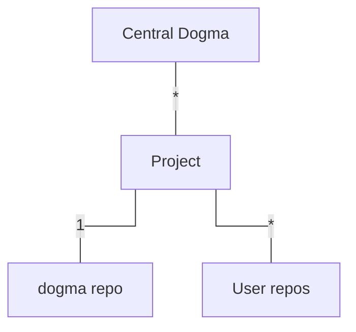

# Concepts

- Project

  - A _project_ is a top-level element in Central Dogma storage model. Each project contains at least one
    repository called `dogma`. A project can have more than one repository.

    :::note

    You may find it easier to understand a project as an 'organization' in GitHub.

    :::

- Repository

  - A _repository_ is where the configuration files of your application are stored actually. It keeps the
    history of each change (commit), such as who added what change when.

    :::note

    You may find it easier to understand a repository as a 'repository' under an organization in GitHub.

    :::

  - User repository

    - A _user repository_ is a repository where a user (i.e. you) store the application configuration files.
      A user can create more than one repository under a project, just like a user creates multiple
      repositories under an organization.

  - Internal repository

    - Every project has a repository named `dogma`. It is dedicated to store the metadata of the project it
      belongs to, such as Git mirroring settings, credentials and permissions. It is not listed with the
      user repositories.

    :::note

    Earlier versions kept this metadata in a repository named `meta`. That repository was migrated into
    `dogma` and no longer exists; the name `meta` is now reserved so that it cannot be reused.

    :::

- Commit

  - A _commit_ is a set of changes added to a repository. Each commit is given a 'revision' when it's added to
    a repository.

- Revision

  - A _revision_ (or revision number) is an integer which refers to a specific point of repository history.
    When a repository is created, it starts with an initial commit whose revision is `1`. As new commits are
    added, each commit gets its own revision number, monotonically increasing from the previous commit's
    revision, such as 1, 2, 3, ...

    :::note

    Unlike Git, although Central Dogma repositories are implemented on top of Git,
    we do not use SHA1-based commit IDs. Also, Central Dogma has no notion of a 'branch.'

    :::

  - A revision can also be represented as a negative integer. When a revision is negative, we start from
    `-1` which refers to the latest commit in repository history, which is often called 'HEAD' of the
    repository. A smaller revision number refers to an older commit. For example, -2 refers to the commit
    before the latest commit, and so on.
  - A revision with a negative integer is called _'relative revision'_. By contrast, a revision with
    a positive integer is called _'absolute revision'_.
