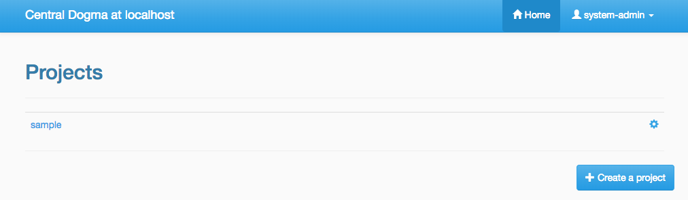

.. _`Apache Shiro`: https://shiro.apache.org/
.. _`keytool`: https://docs.oracle.com/en/java/javase/11/tools/keytool.html
.. _`OpenSAML`: https://wiki.shibboleth.net/confluence/display/OS30/Home
.. _`Quartz cron expression`: https://www.quartz-scheduler.org/documentation/quartz-2.x/tutorials/crontrigger.html
.. _`Security Assertion Markup Language (SAML)`: https://en.wikipedia.org/wiki/Security_Assertion_Markup_Language
.. _`the Caffeine API documentation`: https://static.javadoc.io/com.github.ben-manes.caffeine/caffeine/2.6.2/com/github/benmanes/caffeine/cache/CaffeineSpec.html

.. _auth:

Authentication and Access Control
=================================

Central Dogma provides the following modules to configure its authentication layer:

- ``server-auth-saml``, which is based on `OpenSAML`_
- ``server-auth-shiro``, which is based on `Apache Shiro`_

They are included in the distribution by default so that you can configure the authentication layer with
the following instruction.

Basic authentication configuration
----------------------------------

The first step to configure the authentication layer is adding ``authentication`` property to the
``conf/dogma.json``. The authentication is disabled when ``authentication`` property is ``null``.
The authentication configuration consists of the following properties:

.. code-block:: json

    {
      ...
      "authentication": {
        "factoryClassName": "the fully-qualified class name of an AuthenticationProviderFactory",
        "administrators": [],
        "caseSensitiveLoginNames": false,
        "sessionCacheSpec": "maximumSize=8192,expireAfterWrite=604800s",
        "sessionTimeoutMillis": 604800000,
        "sessionValidationSchedule": "0 30 */4 ? * *",
        "properties": null
      }
    }

- ``factoryClassName`` (string)

  - the fully-qualified class name of the :api:`AuthProviderFactory` implementation. Can be one of
    ``com.linecorp.centraldogma.server.auth.saml.SamlAuthProviderFactory`` or
    ``com.linecorp.centraldogma.server.auth.shiro.ShiroAuthProviderFactory``.

- ``administrators`` (string array)

  - login names of the administrators. A user who has a login name specified here will get the administrator role.

- ``caseSensitiveLoginNames`` (boolean)

  - whether case-sensitive matching is performed when login names are compared. Disabled by default
    (case-insensitive).

- ``sessionCacheSpec`` (string)

  - the cache specification string which determines the capacity and behavior of the cache for the session
    information of the server. Refer to `the Caffeine API documentation`_ for more information.

- ``sessionTimeoutMillis`` (integer)

  - the session timeout for web-based administrative console, in milliseconds. If ``null``, the default value
    of '604800000 milliseconds' (7 days) is used.

- ``sessionValidationSchedule`` (string)

  - a `Quartz cron expression`_ that describes when the task for revalidating the existing sessions is
    supposed to be triggered. If unspecified, ``0 30 */4 ? * *`` (at 0:30, 4:30, 8:30, 12:30, 16:30 and 20:30
    for every day) is used.

- ``properties`` (object)

  - an object which describes authentication provider specific properties.

Configuring authentication with SAML
------------------------------------

`Security Assertion Markup Language (SAML)`_ is an open standard for exchanging authentication and authorization
data between an identity provider and a service provider. In this protocol, Central Dogma acts as a service
provider. So, you need to fill the ``properties`` with information of an identity provider that you delegate
the authentication to.

.. code-block:: json

    {
      ...
      "authentication": {
        "factoryClassName": "com.linecorp.centraldogma.server.auth.saml.SamlAuthProviderFactory",
        "administrators": [],
        "caseSensitiveLoginNames": false,
        "sessionCacheSpec": "maximumSize=8192,expireAfterWrite=604800s",
        "sessionTimeoutMillis": 604800000,
        "sessionValidationSchedule": "0 30 */4 ? * *",
        "properties": {
          "entityId": "dogma",
          "hostname": "dogma-example.linecorp.com",
          "signingKey": "signing",
          "encryptionKey": "encryption",
          "keyStore": {
            "type": "PKCS12",
            "path": "./conf/saml.jks",
            "password": null,
            "keyPasswords": {
              "signing": null,
              "encryption": null
            },
            "signatureAlgorithm": "http://www.w3.org/2000/09/xmldsig#rsa-sha1"
          },
          "idp": {
            "entityId": "some-idp",
            "uri": "https://idp.some-service.com/saml/single_sign_on_service",
            "binding": "HTTP_POST",
            "signingKey": "some-idp",
            "encryptionKey": "some-idp",
            "subjectLoginNameIdFormat": "urn:oasis:names:tc:SAML:1.1:nameid-format:emailAddress",
            "attributeLoginName": null
          }
        }
      }
    }

The following describes the meaning of SAML-specific properties.

- ``entityId`` (string)

  - an identifier of this service provider.

- ``hostname`` (string)

  - a host name which is used for generating URLs for an assertion consumer service, a metadata service and
    a single logout service that are served by this service provider. It should be accessible from a user
    browser.

- ``signingKey`` (string)

  - the name of a private key which is used for signing. If unspecified, ``signing`` is used by default.
    Executing `keytool`_ with ``-genkeypair`` command helps you to create a new key pair in your keystore.

- ``encryptionKey`` (string)

  - the name of a private key which is used for encryption. If unspecified, ``encryption`` is used by default.

- ``keyStore``

  - the keystore which is used to encrypt and decrypt exchanged messages.
  - ``type`` (string)

    - the type of the keystore. If unspecified, the type retrieved from
      ``java.security.KeyStore.getDefaultType()`` is used by default.

  - ``path`` (string)

    - the location of the keystore file.

  - ``password`` (string)

    - the password of the keystore.

  - ``keyPasswords`` (map of string key-value pairs)

    - a map of a key name and its password. If the password is unspecified, the empty string is used by default.

  - ``signatureAlgorithm`` (string)

    - a name of the signature algorithm for signing and encryption.
      If unspecified, ``http://www.w3.org/2000/09/xmldsig#rsa-sha1`` is used by default.

- ``idp``

  - the identity provider configuration.
  - ``entityId`` (string)

    - an identifier of the identity provider.

  - ``uri`` (string)

    - a URL where an authentication request is supposed to be sent to.

  - ``binding`` (string)

    - a binding protocol of the ``uri``. If unspecified, ``urn:oasis:names:tc:SAML:2.0:bindings:HTTP-POST``
      is used by default. It can be simply specified as ``HTTP_POST`` or ``HTTP_REDIRECT``.

  - ``signingKey`` (string)

    - the name of a certificate for signing, which is provided by the identity provider.
      If unspecified, the ``entityId`` is used by default. Executing `keytool`_ with ``-importcert`` command
      helps you to import a certificate of an identity provider to your keystore.

  - ``encryptionKey`` (string)

    - the name of a certificate for encryption, which is provided by the identity provider.
      If unspecified, the ``entityId`` is used by default.

  - ``subjectLoginNameIdFormat`` (string)

    - the name ID format of a subject which holds a login name.
      If unspecified, ``urn:oasis:names:tc:SAML:1.1:nameid-format:emailAddress`` is used by default.
      It means that the email address handed from the identity provider is used as a login name in the
      authentication layer. You need to consult with the metadata of the identity provider before configuring
      this property.

  - ``attributeLoginName`` (string)

    - the attribute name which holds a login name. Some identity provider provides a login name by an attribute,
      instead of a name ID. In this case, you can configure this property, and then set ``subjectLoginNameIdFormat``
      to ``null`` in order to avoid treating an email address as a login name.

Configuring authentication with Apache Shiro
--------------------------------------------

`Apache Shiro`_ is a Java security framework that performs authentication, authorization, cryptography,
and session management. Central Dogma leverages its authentication feature to authenticate a user.
If you want to configure the authentication layer with `Apache Shiro`_, you should configure the ``authentication``
property in your ``conf/dogma.json`` as follows. Note that the path of your INI configuration file is specified
in the ``properties`` property.

.. code-block:: json

    {
      ...
      "authentication": {
        "factoryClassName": "com.linecorp.centraldogma.server.auth.shiro.ShiroAuthProviderFactory",
        "administrators": [],
        "caseSensitiveLoginNames": false,
        "sessionCacheSpec": "maximumSize=8192,expireAfterWrite=604800s",
        "sessionTimeoutMillis": 604800000,
        "sessionValidationSchedule": "0 30 */4 ? * *",
        "properties": "./conf/shiro.ini"
      }
    }

You may configure ``conf/shiro.ini`` simply as follows, which uses a local database system of `Apache Shiro`_:

.. code-block:: ini

    [users]
    system-admin = system-admin-secret
    dogma-admin = dogma-admin-secret

.. note::

    `Apache Shiro`_ supports RDBMS or LDAP based security system as well. You can find the example
    configuration files under the ``conf/`` directory in the distribution.

Access Control
--------------

One way to configure the access control system for Central Dogma is to use the web UI.
To open the web UI, you may access ``http://{your-central-dogma-domain-or-ip}:36462`` in your web browser.
You may configure a project with HTTP APIs, but we recommend the web UI because it is easier and simpler.

Everyone who is logged in is able to create a new project, and he or she would be an owner of the project.
If you have the right to configure a project, in other words, if you are an owner of the project,
you can access the configuration UI of the project by clicking the cog icon which is shown on the right
of the project name.

If you click the icon, you can see the configuration UI for a project like below. In this page, you can
add a user or a token as a member of the project and can also remove them from the project.

.. image:: _images/auth_2.png

When you add a user as a member of the project, you need to choose the role of the member.
There are 4 user role types in the access control system of Central Dogma, but you can choose one
of ``Owner`` and ``Member`` role in the UI. More information about the role is as follows.

- ``Administrator``

  - the user that all permissions are assigned to, a.k.a 'super user'. Only an administrator can restore
    removed project. The administrators can be configured in ``conf/dogma.json`` as described the above.

- ``Owner`` of a project

  - the administrator of a project. A user who creates a project is to be an owner of the project by
    default. Owners can add a user or a token as an owner or a member of the project, and can create
    a new repository. Also, they can remove the repository or the project from the system and can
    configure permissions for each role, member and token.

- ``Member`` of a project

  - users who can see the configuration of a project, but members are not allowed to change the configuration.

- ``Guest`` of a project

  - users who is logged in but is neither an owner nor a member of a project. Guests are not allowed to see
    the configuration of a project.

.. note::

    Do not forget to make a new ``Application Token`` before adding a token to a project. ``Add a token``
    button would be disabled if there is no token. The cog icon on the right of the ``Tokens`` title
    brings you to the ``Application Token`` management page.

You can see the configuration UI for a repository when you click the name of repository in the
``Repository Permission`` list. The following image shows the configuration of the repository called ``main``.
In this page, you can do the followings.

- Changing the role of a member or a token in a project
- Setting permissions of each role for a repository
- Setting permissions of a specific member or token for a repository

.. image:: _images/auth_3.png

Permissions can be specified for a repository only. So a user can configure their repositories with different
access control levels. There are only two permission types currently, which are ``READ`` and ``WRITE``.
``WRITE`` permission implies ``READ`` permission, so you cannot give only WRITE permission to a user,
a token or any role.

Every access of HTTP API will be controlled by the access control system. A request is allowed only if the
user of the request has sufficient permissions. If permissions for the user are specified in the repository
configuration, it would be used first to control the request. If it does not exist, permissions for each role
of the repository would be used to do that.

Application Token
^^^^^^^^^^^^^^^^^

When a user uses the web UI, he or she should login first to get a token for a new web session. But what
should a user do when he or she uses one of Central Dogma clients? The user may log in to a Central Dogma
server via HTTP API and get a session token. But it is inconvenient and the user may write more complicated
code because the user should log in again when the session token is expired. ``Application Token`` would be
useful for this case.

``Application Token`` is like a virtual user, so it can have any role in a project. Also, its permissions
can be specified in a repository configuration like a member. To get a new token, a user can use
``Application Tokens`` menu of the web UI. ``Application ID`` has to be unique to identify where a client
request comes from.

.. image:: _images/auth_4.png

Anyone who is logged into the Central Dogma can create a new ``Application Token``, and the token is shared
for everyone. So any owner of a project can add any token to their project. However only both the token
creator and the administrator are allowed to deactivate and/or remove the token.

There are two levels of a token, which are ``Admin`` and ``User``. ``Admin`` level token can be created by
only the administrators. A client who sends a request with the token is allowed to access administrator-level
APIs.
