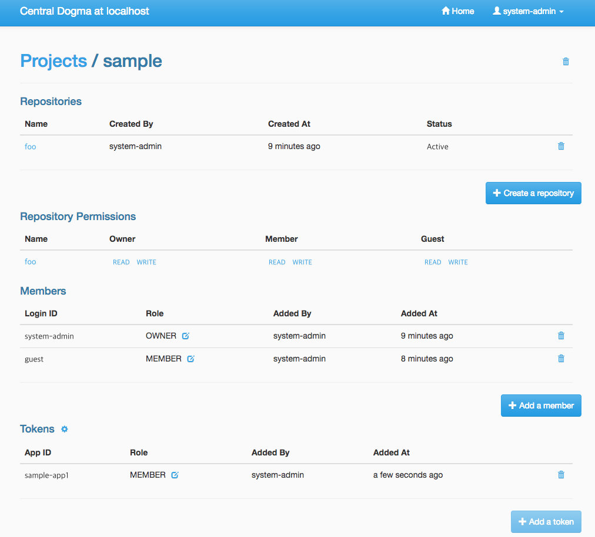
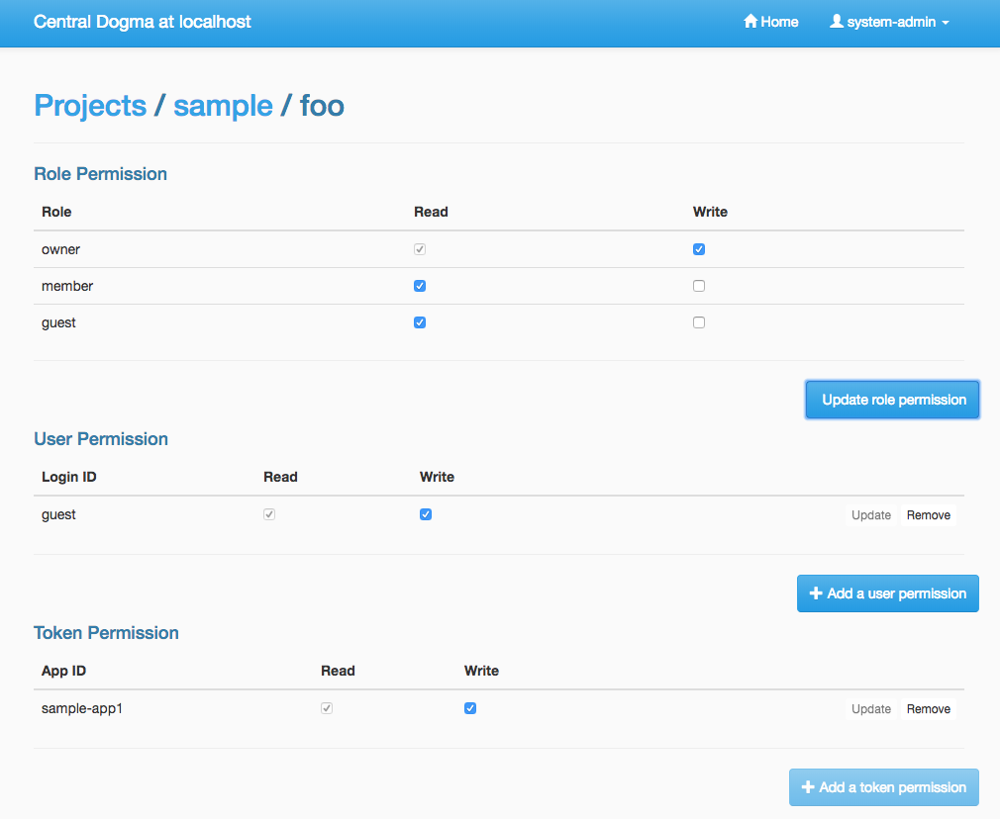
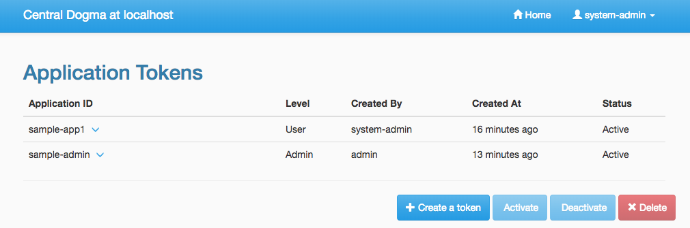

.. _`Apache Shiro`: https://shiro.apache.org/

.. _auth:

Authentication and Access Control
=================================

Central Dogma provides the features for authentication and access control.

Authentication
--------------

For authentication, `Apache Shiro`_ is used as its authentication layer and ``conf/shiro.ini`` file is used
as its security configuration. Please follow the steps below to turn on the security system of Central Dogma.

First, enable the security system by configuring ``conf/dogma.json``. Specify login IDs of the administrators
there, too:

.. code-block:: javascript

    {
        ...
        "securityEnabled": true,
        "administrators": [
            "system-admin", "dogma-admin"
        ]
        ...
    }

Next, configure ``conf/shiro.ini`` based on your authentication system. A local database system of
`Apache Shiro`_ is used here to show you a simple example:

.. code-block:: ini

    [users]
    system-admin = system-admin-secret
    dogma-admin = dogma-admin-secret

.. note::

    `Apache Shiro`_ supports RDBMS or LDAP based security system as well. You can find the example
    configuration files under the ``conf/`` directory in the distribution.

That's all. Now, you are ready to use the security system of Central Dogma.

Access Control
--------------

One way to configure the access control system for Central Dogma is to use the web UI.
To open the web UI, you may access ``http://{your-central-dogma-domain-or-ip}:36462`` in your web browser.
You may configure a project with HTTP APIs, but we recommend the web UI because it is easier and simpler.

Everyone who is logged in is able to create a new project, and he or she would be an owner of the project.
If you have the right to configure a project, in other words, if you are an owner of the project,
you can access the configuration UI of the project by clicking the cog icon which is shown on the right
of the project name.

.. image:: _images/auth_1.png

If you click the icon, you can see the configuration UI for a project like below. In this page, you can
add a user or a token as a member of the project and can also remove them from the project.

When you add a user as a member of the project, you need to choose the role of the member.
There are 4 user role types in the access control system of Central Dogma, but you can choose one
of ``Owner`` and ``Member`` role in the UI. More information about the role is as follows.

- ``Administrator``

  - the user that all permissions are assigned to, a.k.a 'super user'. Only an administrator can restore
    removed project. The administrators can be configured in ``conf/dogma.json`` as described the above.

- ``Owner`` of a project

  - the administrator of a project. A user who creates a project is to be an owner of the project by
    default. Owners can add a user or a token as an owner or a member of the project, and can create
    a new repository. Also, they can remove the repository or the project from the system and can
    configure permissions for each role, member and token.

- ``Member`` of a project

  - users who can see the configuration of a project, but members are not allowed to change the configuration.

- ``Guest`` of a project

  - users who is logged in but is neither an owner nor a member of a project. Guests are not allowed to see
    the configuration of a project.

.. note::

    Do not forget to make a new ``Application Token`` before adding a token to a project. ``Add a token``
    button would be disabled if there is no token. The cog icon on the right of the ``Tokens`` title
    brings you to the ``Application Token`` management page.

You can see the configuration UI for a repository when you click the name of repository in the
``Repository Permission`` list. The following image shows the configuration of the repository called ``main``.
In this page, you can do the followings.

- Changing the role of a member or a token in a project
- Setting permissions of each role for a repository
- Setting permissions of a specific member or token for a repository

Permissions can be specified for a repository only. So a user can configure their repositories with different
access control levels. There are only two permission types currently, which are ``READ`` and ``WRITE``.
``WRITE`` permission implies ``READ`` permission, so you cannot give only WRITE permission to a user,
a token or any role.

Every access of HTTP API will be controlled by the access control system. A request is allowed only if the
user of the request has sufficient permissions. If permissions for the user are specified in the repository
configuration, it would be used first to control the request. If it does not exist, permissions for each role
of the repository would be used to do that.

Application Token
^^^^^^^^^^^^^^^^^

When a user uses the web UI, he or she should login first to get a token for a new web session. But what
should a user do when he or she uses one of Central Dogma clients? The user may log in to a Central Dogma
server via HTTP API and get a session token. But it is inconvenient and the user may write more complicated
code because the user should log in again when the session token is expired. ``Application Token`` would be
useful for this case.

``Application Token`` is like a virtual user, so it can have any role in a project. Also, its permissions
can be specified in a repository configuration like a member. To get a new token, a user can use
``Application Tokens`` menu of the web UI. ``Application ID`` has to be unique to identify where a client
request comes from.

Anyone who is logged into the Central Dogma can create a new ``Application Token``, and the token is shared
for everyone. So any owner of a project can add any token to their project. However only both the token
creator and the administrator are allowed to deactivate and/or remove the token.

There are two levels of a token, which are ``Admin`` and ``User``. ``Admin`` level token can be created by
only the administrators. A client who sends a request with the token is allowed to access administrator-level
APIs.

.. note::

    The Java client library is not under the access control system for now. Currently it accesses Central Dogma
    via Thrift API but would replace its underlying API requests with HTTP API soon. After that, it would be
    under the access control system and you can use ``Application Token`` to control the accesses from a user.
