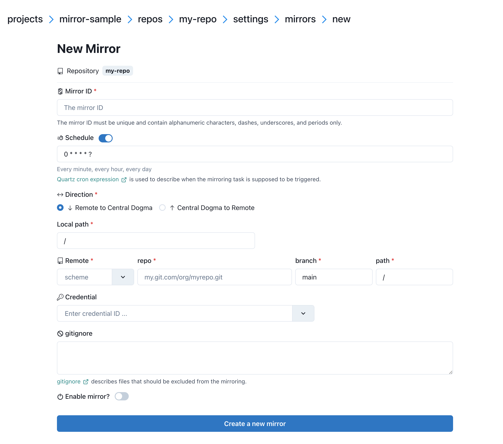

.. _mirroring:

Better configuration change workflow with Git-to-CD mirroring
=============================================================
Making a configuration change is often a risky business. Pushing an invalid configuration change can cause your
service to malfunction even if zero line of code is changed. To reduce the chance of outage due to incorrect
configuration changes, you would want them reviewed by many eyes before they are applied.

Modern source code hosting services such as `GitHub <https://github.com/>`_ and `GitLab <https://about.gitlab.com/>`_
have a notion of `pull request <https://help.github.com/articles/about-pull-requests/>`_. What if we use pull
requests for configuration changes just like we do for source code, given the importance of service
configuration?

With Central Dogma's periodic Git repository mirroring, you can set up the following workflow in your
organization:

- Humans work on a Git repository to manage the configuration files.

  1. Store the configuration files in a Git repository.
  2. Send a pull request that updates the configuration files.
  3. The pull request is reviewed and merged.

- Applications work on a Central Dogma repository to retrieve the configuration files.

  1. Central Dogma mirrors the configuration files in the Git repository into a Central Dogma repository.
  2. Applications watches the configuration files in the Central Dogma repository.

Note that the applications do not access Git repositories directly. There are a few good reasons to make your
applications access Central Dogma repositories instead:

- Source code repositories are often hosted in a different network.
- Source code repositories are not always highly-available, although they may be backed up regularly.
- Central Dogma repositories are highly-available, queryable and watchable.

Setting up a mirror
-------------------
First, you need to create a credential to access the Git repository. You can create a project-wide credential
via project settings or a repository-specific credential via repository settings.

Currently, you can use SSH key authentication, password-based authentication, or access token-based authentication.

Setting up a mirroring task
^^^^^^^^^^^^^^^^^^^^^^^^^^^

You can set up a mirroring task via repository settings.

Here is the properties of the mirroring task:

- ``Mirror ID``

  - the ID of the mirroring task. This must be unique in the repository.

- ``Schedule``

  - a `Quartz cron expression <https://www.quartz-scheduler.org/documentation/quartz-2.3.0/tutorials/crontrigger.html>`_
    that describes when the mirroring task is supposed to be triggered. If unspecified, ``0 * * * * ?``
    (every minute) is used.

- ``Direction``

  - the direction of mirror.

- ``Local path``

  - the directory path. The content of the ``remote path`` will be mirrored into this directory.
    If unspecified, ``/`` is used.

- ``Remote``

  - Supported schemes are:

    - ``git+http``
    - ``git+https``
    - ``git+ssh``

  - ``repo``

    - the uri of the remote Git repository except the scheme.
      e.g. ``github.com/foo.git``

  - ``branch``

    - the branch name of the remote Git repository. If unspecified, the default branch of the remote
      Git repository is used.

  - ``path``

    - the path of the remote Git repository. If unspecified, the whole content of
      the remote Git repository is mirrored.

- ``Credential``

  - the ID of the credential to use for authentication.

- ``gitignore``

  - a `gitignore <https://git-scm.com/docs/gitignore>` specifies files that should be excluded from mirroring.
    The type of gitignore can either be a string containing the entire file (e.g. ``/filename.txt\ndirectory``) or an array 
    of strings where each line represents a single pattern.

- ``Zone`` (Displayed only if ``zone`` in the :ref:`setup-configuration` is configured)

   - the zone where the mirroring task is executed.

   - If unspecified:

     - a mirroring task is executed in the first zone of ``zone.allZones`` configuration.
     - if ``zone.allZones`` is not configured, a mirroring task is executed in the leader replica.

- ``Preserve upstream commit history``

  - whether each remote commit becomes its own revision. The option is disabled by default.

  - See `Preserving the upstream commit history`_ below.

- ``Enable mirror``

  - whether the mirroring task is enabled.

Preserving the upstream commit history
^^^^^^^^^^^^^^^^^^^^^^^^^^^^^^^^^^^^^^

By default a mirroring run pushes whatever the remote repository looks like at that moment as a single
revision, so several remote commits merged in quick succession end up in one revision. Turning on
``Preserve upstream commit history`` replays them one by one instead, which lets you pin the state where
only one pull request has been applied.

Each revision created this way records the SHA-1 of the remote commit it came from, shows it in the commit
history next to Central Dogma's own commit SHA-1, and is tagged ``refs/tags/dogma-<remote SHA-1>``. Because
Central Dogma serves its repositories over the Git HTTP protocol, that tag can be used as a Git label:

.. code-block:: yaml

    # Spring Cloud Config Server -> Central Dogma
    spring.cloud.config.server.git.uri: https://centraldogma.example.com/myproject/config-repo.git
    spring.cloud.config.server.git.username: dogma        # Use this literal. The password is an access token.

    # Client
    spring.cloud.config.label: dogma-3f2a1c9e8b7d6540a1b2c3d4e5f60718293a4b5c

Note the following limitations:

- **One revision per remote commit is guaranteed only for fast-forward pushes.** A new mirror's first run
  creates one snapshot revision. Any non-fast-forward update also creates one snapshot revision at the new
  remote head. A snapshot receives a tag for the remote head only.

- **A single run replays at most 100 commits.** If more than 100 commits are reachable from the remote head,
  the run creates one snapshot revision instead. This limit also applies to histories with merge commits.

- Tags are immutable. If a reconciliation snapshot refers to an upstream commit that was tagged by an earlier
  revision, the existing tag does not move and the new snapshot is left without an upstream mapping.

- **A remote commit that changes nothing within the mirrored path still creates a revision**, because the
  revision records which remote commit the repository is at. Expect this if ``remote path`` covers only a
  part of a busy repository.

- Only one mirror targeting a repository may enable this option. The ``dogma-<remote SHA-1>`` tag belongs to
  the target repository, so two preserving mirrors could otherwise assign the same tag to different states.

- The option is unavailable for:

  - ``LOCAL_TO_REMOTE`` mirrors
  - Central Dogma to Central Dogma mirrors
  - encrypted repositories

- A repository with this option configured cannot be migrated to encrypted storage.

- During an upgrade, enable this option only after every replica is running a version that supports it.

Central Dogma to Central Dogma mirroring
----------------------------------------
In addition to Git-to-CD mirroring, Central Dogma supports mirroring between two Central Dogma servers.
This is useful when you want to replicate configuration across multiple Central Dogma clusters, such as
syncing configurations between different environments or regions.

Setting up a CD-to-CD mirror
^^^^^^^^^^^^^^^^^^^^^^^^^^^^^
The setup is similar to Git mirroring, with a few differences:

- ``Remote``

  - Supported schemes are:

    - ``dogma`` - connects to a remote Central Dogma server via plain HTTP.
    - ``dogma+https`` - connects to a remote Central Dogma server via HTTPS.

  - ``repo``

    - the URI of the remote Central Dogma repository.
      The format is ``<host>[:<port>]/<project>/<repository>.dogma``.
      e.g. ``my-cd.com:36462/myproject/myrepo.dogma``

  - ``path``

    - the path within the remote Central Dogma repository. If unspecified, the whole content of the remote
      repository is mirrored.

  - Unlike Git mirroring, the ``branch`` field is not used because Central Dogma has no notion of branches.

- ``Credential``

  - An access token credential must be used for authentication to the remote Central Dogma server.

- ``Direction``

  - ``REMOTE_TO_LOCAL``: Replicates files from a remote Central Dogma repository to the local repository.
  - ``LOCAL_TO_REMOTE``: Pushes files from the local repository to a remote Central Dogma repository.

- ``gitignore``

  - gitignore patterns are also supported for CD-to-CD mirroring, allowing you to exclude specific files
    from being mirrored.

All other properties (``Mirror ID``, ``Schedule``, ``Local path``, ``Zone``, ``Enable mirror``) work the
same way as in Git mirroring.

Mirror limit settings
^^^^^^^^^^^^^^^^^^^^^^
Central Dogma limits the number of files and the total size of the files in a mirror for its reliability.
As your configuration grows, you may want to bump the limit. See :ref:`setup-configuration` to learn about
the options related with mirroring: ``numMirroringThreads``, ``maxNumFilesPerMirror`` and
``maxNumBytesPerMirror``.
