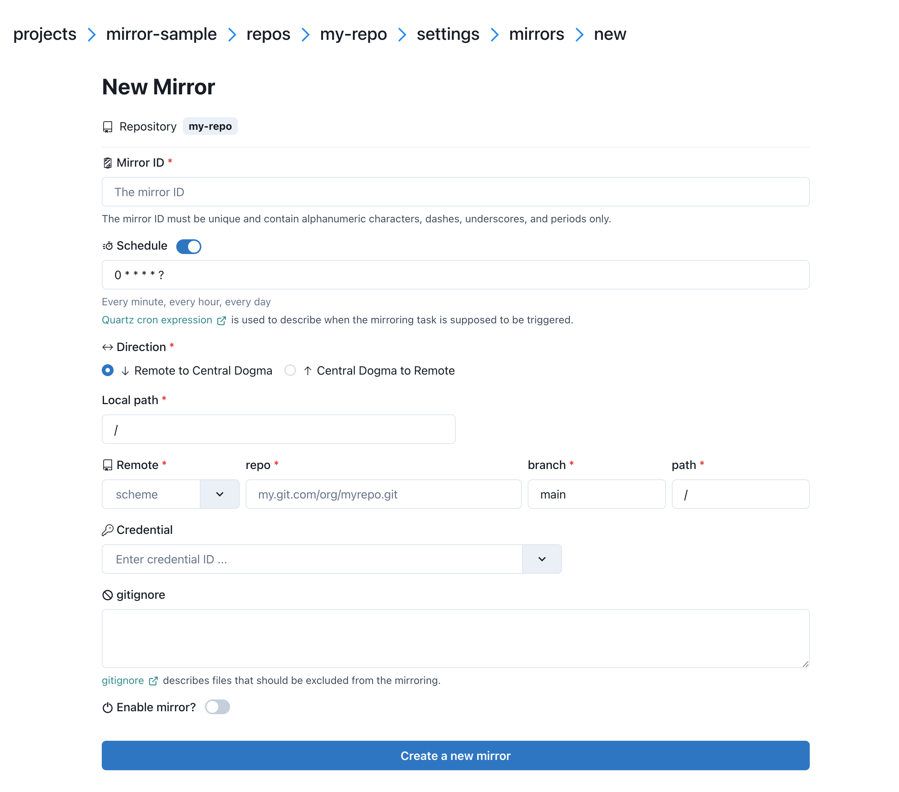

.. _mirroring:

Better configuration change workflow with Git-to-CD mirroring
=============================================================
Making a configuration change is often a risky business. Pushing an invalid configuration change can cause your
service to malfunction even if zero line of code is changed. To reduce the chance of outage due to incorrect
configuration changes, you would want them reviewed by many eyes before they are applied.

Modern source code hosting services such as `GitHub <https://github.com/>`_ and `GitLab <https://about.gitlab.com/>`_
have a notion of `pull request <https://help.github.com/articles/about-pull-requests/>`_. What if we use pull
requests for configuration changes just like we do for source code, given the importance of service
configuration?

With Central Dogma's periodic Git repository mirroring, you can set up the following workflow in your
organization:

- Humans work on a Git repository to manage the configuration files.

  1. Store the configuration files in a Git repository.
  2. Send a pull request that updates the configuration files.
  3. The pull request is reviewed and merged.

- Applications work on a Central Dogma repository to retrieve the configuration files.

  1. Central Dogma mirrors the configuration files in the Git repository into a Central Dogma repository.
  2. Applications watches the configuration files in the Central Dogma repository.

Note that the applications do not access Git repositories directly. There are a few good reasons to make your
applications access Central Dogma repositories instead:

- Source code repositories are often hosted in a different network.
- Source code repositories are not always highly-available, although they may be backed up regularly.
- Central Dogma repositories are highly-available, queryable and watchable.

Setting up a mirror
-------------------
First, you need to create a credential to access the Git repository. You can create a project-wide credential
via project settings or a repository-specific credential via repository settings.

Currently, you can use SSH key authentication, password-based authentication, or access token-based authentication.

Setting up a mirroring task
^^^^^^^^^^^^^^^^^^^^^^^^^^^

You can set up a mirroring task via repository settings.

Here is the properties of the mirroring task:

- ``Mirror ID``

  - the ID of the mirroring task. This must be unique in the repository.

- ``Schedule``

  - a `Quartz cron expression <https://www.quartz-scheduler.org/documentation/quartz-2.3.0/tutorials/crontrigger.html>`_
    that describes when the mirroring task is supposed to be triggered. If unspecified, ``0 * * * * ?``
    (every minute) is used.

- ``Direction``

  - the direction of mirror.

- ``Local path``

  - the directory path. The content of the ``remote path`` will be mirrored into this directory.
    If unspecified, ``/`` is used.

- ``Remote``

  - Supported schemes are:

    - ``git+http``
    - ``git+https``
    - ``git+ssh``

  - ``repo``

    - the uri of the remote Git repository except the scheme.
      e.g. ``github.com/foo.git``

  - ``branch``

    - the branch name of the remote Git repository. If unspecified, the default branch of the remote
      Git repository is used.

  - ``path``

    - the path of the remote Git repository. If unspecified, the whole content of
      the remote Git repository is mirrored.

- ``Credential``

  - the ID of the credential to use for authentication.

- ``gitignore``

  - a `gitignore <https://git-scm.com/docs/gitignore>` specifies files that should be excluded from mirroring.
    The type of gitignore can either be a string containing the entire file (e.g. ``/filename.txt\ndirectory``) or an array 
    of strings where each line represents a single pattern.

- ``Zone`` (Displayed only if ``zone`` in the :ref:`setup-configuration` is configured)

   - the zone where the mirroring task is executed.

   - If unspecified:

     - a mirroring task is executed in the first zone of ``zone.allZones`` configuration.
     - if ``zone.allZones`` is not configured, a mirroring task is executed in the leader replica.

- ``Enable mirror``

  - whether the mirroring task is enabled.

Mirror limit settings
---------------------
Central Dogma limits the number of files and the total size of the files in a mirror for its reliability.
As your configuration grows, you may want to bump the limit. See :ref:`setup-configuration` to learn about
the options related with mirroring: ``numMirroringThreads``, ``maxNumFilesPerMirror`` and
``maxNumBytesPerMirror``.
