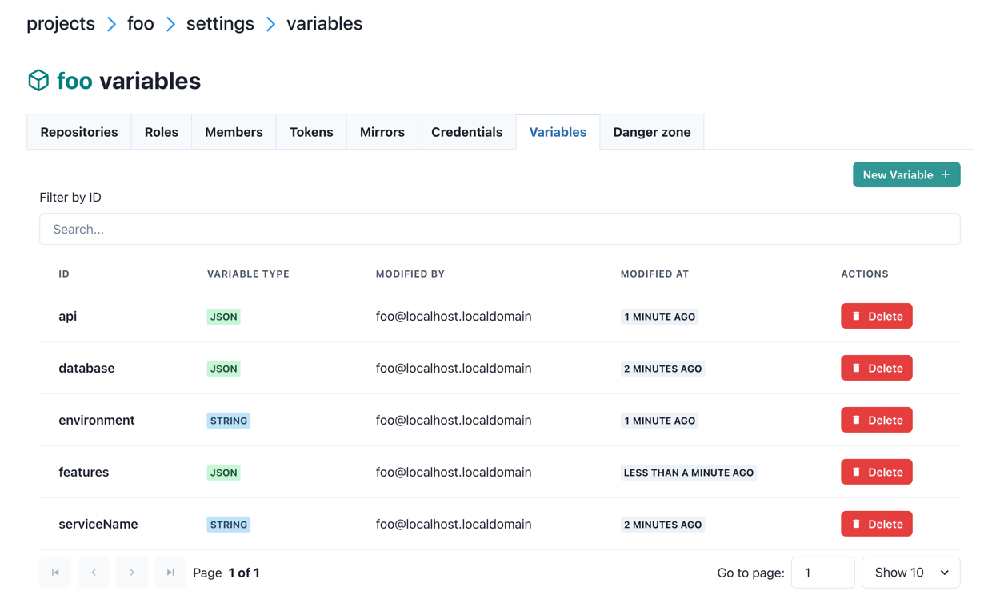
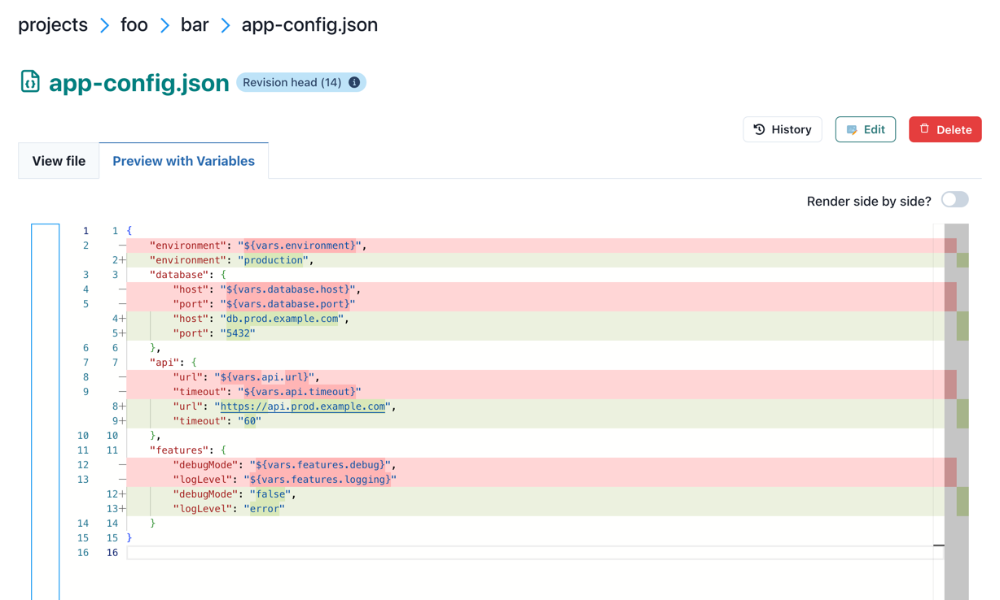

.. _templates-variables:

Templates and Variables
=======================

Central Dogma supports dynamic configuration through **templates** and **variables**. Templates allow you to use
placeholder syntax in your configuration files, which are then replaced with actual values from variables at
runtime. This enables you to:

- Manage multiple environments (development, staging, production) with a single template
- Centralize common configuration values and reuse them across multiple files
- Separate sensitive data from configuration structure
- Apply configuration changes without modifying template files

Overview
--------

A **template** is any configuration file that contains variable placeholders using the syntax ``${vars.varName}``.
When you fetch a file with template rendering enabled, Central Dogma replaces these placeholders with actual
values from variables.

A **variable** is a named value stored at the project or repository level. Variables can be simple strings or
complex JSON objects. For example, a JSON template file ``/config.json``:

.. code-block:: json

    {
      "apiEndpoint": "${vars.api.url}",
      "timeout": "${vars.api.timeout}",
      "debugMode": "${vars.debug}"
    }

Or a YAML template file ``/config.yaml``:

.. code-block:: yaml

    apiEndpoint: ${vars.api.url}
    timeout: ${vars.api.timeout}
    debugMode: ${vars.debug}

With variables defined as:

- ``api``: ``{"url": "https://api.example.com", "timeout": 30}`` (JSON type)
- ``debug``: ``false`` (STRING type)

When fetched with ``renderTemplate=true``, the JSON template produces:

.. code-block:: json

    {
      "apiEndpoint": "https://api.example.com",
      "timeout": "30",
      "debugMode": "false"
    }

And the YAML template produces:

.. code-block:: yaml

    apiEndpoint: https://api.example.com
    timeout: 30
    debugMode: false

Variable Types
--------------

Central Dogma supports two types of variables:

STRING type
^^^^^^^^^^^

A **STRING** variable stores a text value as-is. When used in templates, the quoting requirements depend on
the template file format:

- **JSON templates**: Variables must be quoted to maintain valid JSON syntax
- **YAML templates**: Variables don't need quotes (YAML accepts unquoted strings)

Example variable:

- ID: ``serviceName``
- Type: ``STRING``
- Value: ``user-service``

Usage in JSON template:

.. code-block:: json

    {
      "name": "${vars.serviceName}"
    }

Usage in YAML template:

.. code-block:: yaml

    name: ${vars.serviceName}

Rendered JSON output:

.. code-block:: json

    {
      "name": "user-service"
    }

Rendered YAML output:

.. code-block:: yaml

    name: user-service

.. note::

    In JSON templates, quotes around ``"${vars.serviceName}"`` are required because Central Dogma validates the
    template file as valid JSON when storing it. Without quotes, ``${vars.serviceName}`` would be invalid JSON
    syntax. YAML templates don't have this restriction since YAML accepts unquoted strings.

JSON type
^^^^^^^^^

A **JSON** variable stores structured data (objects, arrays, numbers, booleans, null). The value must be valid
JSON. When used in templates, the quoting requirements depend on the template file format:

- **JSON templates**: Variables must be quoted to maintain valid JSON syntax
- **YAML templates**: Variables don't need quotes (YAML accepts unquoted strings)

Example variable:

- ID: ``database``
- Type: ``JSON``
- Value: ``{"host": "db.example.com", "port": 5432, "ssl": true}``

Usage in JSON template:

.. code-block:: json

    {
      "dbHost": "${vars.database.host}",
      "dbPort": "${vars.database.port}",
      "useSsl": "${vars.database.ssl}"
    }

Usage in YAML template:

.. code-block:: yaml

    dbHost: ${vars.database.host}
    dbPort: ${vars.database.port}
    useSsl: ${vars.database.ssl}

Rendered JSON output:

.. code-block:: json

    {
      "dbHost": "db.example.com",
      "dbPort": "5432",
      "useSsl": "true"
    }

Rendered YAML output:

.. code-block:: yaml

    dbHost: db.example.com
    dbPort: 5432
    useSsl: true

.. tip::

    Jackson converts the quoted JSON values to the proper types when a ``JsonNode`` is converted into a Java
    object. For example, in the rendered JSON output above, ``"${vars.database.port}"`` becomes the string ``"5432"``
    in the rendered JSON, but when deserialized into a Java class with an ``int`` field for ``dbPort``,
    Jackson will automatically convert ``"5432"`` to the number ``5432``.
    For more details on Jackson coercions, see
    `Jackson 2.12 Most Wanted (4/5) <https://cowtowncoder.medium.com/jackson-2-12-most-wanted-4-5-cbc91c00bcd2>`_.

Template Syntax
---------------

Basic variable interpolation
^^^^^^^^^^^^^^^^^^^^^^^^^^^^^

Use ``${vars.varName}`` to reference a variable:

.. code-block:: text

    Application: ${vars.appName}
    Version: ${vars.version}

Nested JSON object access
^^^^^^^^^^^^^^^^^^^^^^^^^^

For JSON variables containing objects, use dot notation to access nested properties.

**In JSON templates** (quotes required):

.. code-block:: json

    {
      "host": "${vars.database.host}",
      "port": "${vars.database.port}",
      "endpoint": "${vars.api.url}",
      "timeout": "${vars.api.timeout}"
    }

**In YAML templates** (quotes not required):

.. code-block:: yaml

    host: ${vars.database.host}
    port: ${vars.database.port}
    endpoint: ${vars.api.url}
    timeout: ${vars.api.timeout}

The JSON variable must contain an object with the specified property.

.. warning::

    **Avoid using FreeMarker directives** like ``<#if>``, ``<#list>``, or ``<#assign>`` in JSON or YAML templates.
    These directives can break JSON/YAML syntax and make your configuration files invalid when stored.
    Stick to simple variable interpolation with ``${vars.varName}`` syntax.

    If you need to use FreeMarker directives, use a file extension like ``.json.ftl`` or ``.yaml.ftl`` instead
    of ``.json`` or ``.yaml``. Central Dogma does not validate ``.ftl`` files as JSON/YAML, so the directives
    won't cause syntax errors during storage.

Variable Precedence
-------------------

Variables can be defined at multiple levels, and they are merged with a specific precedence order. Later
levels override earlier levels for variables with the same ID.

Precedence hierarchy (from lowest to highest):

1. **Project-level variables** - Available to all repositories in the project
2. **Repository-level variables** - Available only within the specific repository
3. **Root variable file** (``/.variables.*``) - Defined in the repository root directory
4. **Entry path variable file** (e.g., ``/configs/.variables.*``) - Defined in the same directory as the template
5. **Client-specified variable file** - Explicitly specified when fetching (e.g., ``/vars/prod.json``)

Example scenario
^^^^^^^^^^^^^^^^

Given these variables:

**Project level:**

- ``timeout``: ``30``
- ``region``: ``"us-west"``

**Repository level:**

- ``timeout``: ``60``
- ``env``: ``"staging"``

**Root file** ``/.variables.json``:

.. code-block:: json

    {
      "timeout": 90,
      "debug": true
    }

**Client-specified file** ``/vars/prod.json``:

.. code-block:: json

    {
      "env": "production",
      "debug": false
    }

When fetching with ``renderTemplate("/vars/prod.json")``, the merged variables are:

- ``timeout``: ``90`` (from root file, overrides repo and project)
- ``region``: ``"us-west"`` (from project, no overrides)
- ``env``: ``"production"`` (from client file, overrides repo)
- ``debug``: ``false`` (from client file, overrides root file)

Variable Files
--------------

In addition to project and repository-level variables, you can create **variable files** in your repository.
These are regular files that contain variable definitions in JSON, JSON5, or YAML format.

Supported formats and priority
^^^^^^^^^^^^^^^^^^^^^^^^^^^^^^^

When multiple variable files exist at the same path (e.g., both ``/.variables.json`` and ``/.variables.yaml``),
the first file found in this order is used:

1. ``.variables.json``
2. ``.variables.json5``
3. ``.variables.yaml``
4. ``.variables.yml``

.. tip::

    To avoid confusion, use only one format per directory.

Default variable files
^^^^^^^^^^^^^^^^^^^^^^

Central Dogma automatically looks for variable files in two locations:

1. **Repository root**: ``/.variables.{json,json5,yaml,yml}``

   Applied to all templates in the repository.

2. **Template directory**: ``/path/to/.variables.{json,json5,yaml,yml}``

   Applied only to templates in the same directory.

Example ``/.variables.json``:

.. code-block:: json

    {
      "appName": "MyApp",
      "version": "1.0.0",
      "database": {
        "host": "db.example.com",
        "port": 5432
      }
    }

Custom variable files
^^^^^^^^^^^^^^^^^^^^^

You can also create custom variable files for different environments and explicitly specify which one to use
when fetching templates.

Example structure:

.. code-block:: text

    /
    ├── .variables.json          # Common defaults
    ├── vars/
    │   ├── dev.json             # Development overrides
    │   ├── staging.json         # Staging overrides
    │   └── prod.json            # Production overrides
    └── config.json              # Template file

``/.variables.json`` (common defaults):

.. code-block:: json

    {
      "database": {
        "host": "localhost",
        "port": 5432
      },
      "api": {
        "url": "http://localhost:8080",
        "timeout": 30
      }
    }

``/vars/prod.json`` (production overrides):

.. code-block:: json

    {
      "database": {
        "host": "db.prod.example.com",
        "port": 5432
      },
      "api": {
        "url": "https://api.prod.example.com",
        "timeout": 60
      }
    }

When you fetch ``/config.json`` with ``renderTemplate("/vars/prod.json")``, both files are merged with
production values taking precedence.

Java Client API
---------------

Rendering templates with file fetch
^^^^^^^^^^^^^^^^^^^^^^^^^^^^^^^^^^^

Use ``renderTemplate(true)`` to automatically resolve variables from project, repository, and default
variable files:

.. code-block:: java

    import com.linecorp.centraldogma.client.CentralDogma;
    import com.linecorp.centraldogma.common.Entry;
    import com.linecorp.centraldogma.common.Query;

    CentralDogma dogma = ...;

    // Fetch template without rendering
    Entry<String> template = dogma.forRepo("myProject", "myRepo")
                                  .file(Query.ofText("/config.json"))
                                  .get()
                                  .join();
    System.out.println(template.content());
    // Output: {"serviceName": "${vars.serviceName}", "timeout": "${vars.timeout}"}

    // Fetch with template rendering enabled
    Entry<String> rendered = dogma.forRepo("myProject", "myRepo")
                                  .file(Query.ofText("/config.json"))
                                  .renderTemplate(true)
                                  .get()
                                  .join();
    System.out.println(rendered.content());
    // Output: {"serviceName": "user-service", "timeout": "30"}

Use ``renderTemplate(String variableFile)`` to specify a custom variable file:

.. code-block:: java

    // Fetch with custom variable file for production environment
    Entry<String> prodConfig = dogma.forRepo("myProject", "myRepo")
                                    .file(Query.ofText("/config.json"))
                                    .renderTemplate("/vars/prod.json")
                                    .get()
                                    .join();
    System.out.println(prodConfig.content());

Watching templates with Watcher
^^^^^^^^^^^^^^^^^^^^^^^^^^^^^^^^

Use ``Watcher`` to get notified when templates or their variables change:

.. code-block:: java

    import com.linecorp.centraldogma.client.Watcher;

    // Watch a template with automatic rendering
    Watcher<JsonNode> watcher = dogma.forRepo("myProject", "myRepo")
                                     .watcher(Query.ofJson("/config.json"))
                                     .renderTemplate(true)
                                     .start();

    // Get initial value
    JsonNode initialValue = watcher.awaitInitialValue().value();
    System.out.println(initialValue);

    // Listen for changes
    watcher.watch(revision -> {
        JsonNode newValue = revision.value();
        System.out.println("Configuration updated: " + newValue);
    });

The watcher will be notified when:

- The template file itself is modified
- Any project or repository-level variable used in the template changes
- The default variable files (``.variables.[json|json5|yaml|yml]``) change

Watch with custom variable file:

.. code-block:: java

    // Watch template with production variable file
    Watcher<JsonNode> prodWatcher = dogma.forRepo("myProject", "myRepo")
                                         .watcher(Query.ofJson("/config.json"))
                                         .renderTemplate("/vars/prod.json")
                                         .start();

Web UI
------

Permissions
^^^^^^^^^^^

The Variable UI requires specific roles:

- **Project-level variables**: Requires ``MEMBER`` role or higher in the project
- **Repository-level variables**: Requires ``WRITE`` role or higher in the repository

Managing variables
^^^^^^^^^^^^^^^^^^

You can manage variables through the Central Dogma web interface.

**Navigating to variables:**

- For project-level variables: Go to ``/app/projects/{projectName}/settings/variables``
- For repository-level variables: Go to ``/app/projects/{projectName}/repos/{repoName}/settings/variables``

The variables list page shows all defined variables:

Creating and editing variables
^^^^^^^^^^^^^^^^^^^^^^^^^^^^^^^

Click "New Variable" or click on a variable ID to open the variable form:

.. image:: _images/variable-form.png
   :alt: Variable form with ID, type selector, value editor, and description fields

The form includes:

- **Variable ID**: Alphanumeric identifier starting with a letter. Cannot be changed after creation.
- **Type**: Radio buttons to select STRING or JSON type
- **Value**:
    - For STRING: Single-line text input
    - For JSON: Multi-line textarea with JSON syntax validation
- **Description**: Optional text area to document the variable's purpose

Previewing templates with variables
^^^^^^^^^^^^^^^^^^^^^^^^^^^^^^^^^^^^

When viewing a file in the File Editor, the second tab "Preview with Variables" shows the rendered output:

This tab shows:

- The file content with all variables resolved
- Real-time preview as you navigate between files
- Rendering uses all applicable variables (project, repository, and file-level)
- Any rendering errors are displayed if variables are undefined or malformed

The preview helps you verify that your templates will render correctly before deploying to production.
