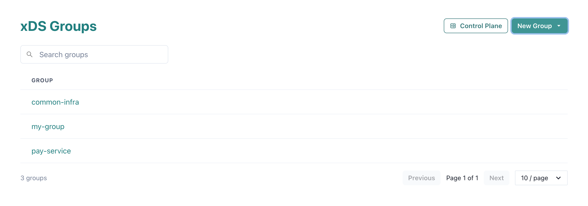
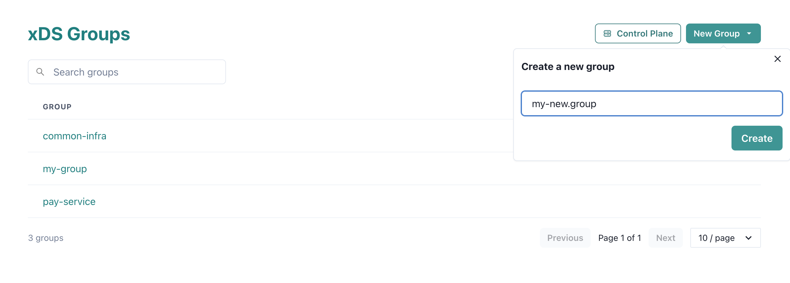
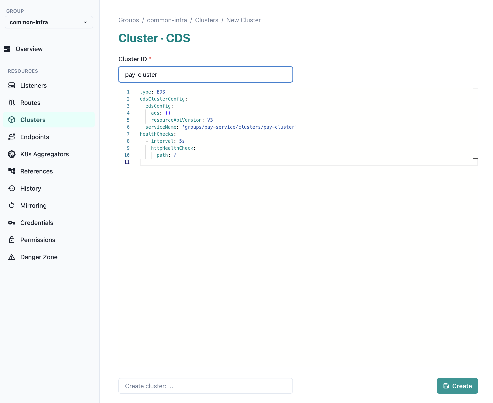
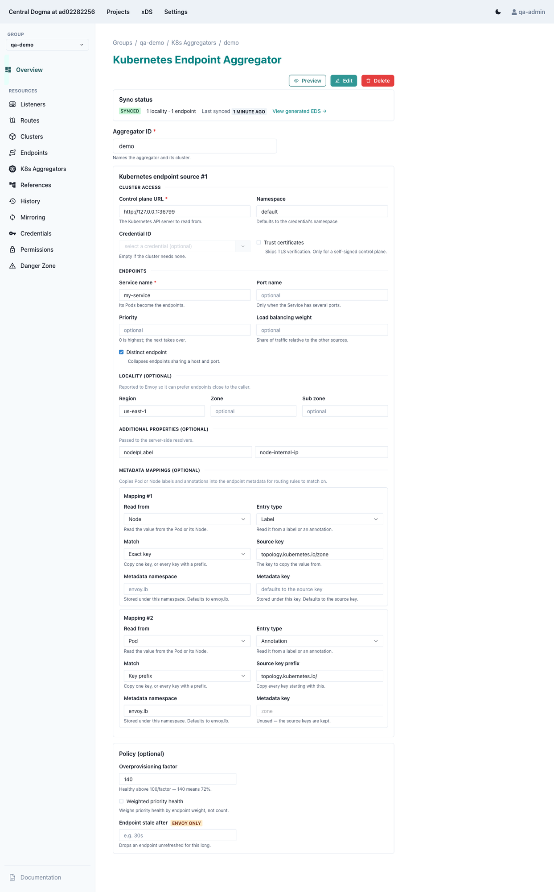

.. _xds:

Serving Envoy configuration with the xDS control plane
=======================================================
Central Dogma can act as an `Envoy <https://www.envoyproxy.io/>`__
`xDS <https://www.envoyproxy.io/docs/envoy/latest/api-docs/xds_protocol>`__ v3 control plane. It stores Envoy
resources — Listeners, Routes, Clusters and Endpoints — as version-controlled YAML files, lets you edit them
through the Web UI, and serves them to Envoy and Armeria clients over the gRPC xDS discovery services — LDS,
RDS, CDS, EDS and the aggregated ADS.

Because the resources live in ordinary Central Dogma repositories, every change is reviewable, auditable and
revertible, and you can watch or mirror them just like any other configuration file. This brings the
:ref:`configuration change workflow <mirroring>` and :ref:`access control <auth>` you already use for your
YAML settings to your Envoy service mesh.

.. note::

    The xDS control plane runs only when the xDS plugin is enabled on the server. When it is enabled, the Web
    UI exposes the xDS console at ``/app/xds``.

Concepts
--------
- **Group** — the unit of organization and access control. A group is a repository under the internal
  ``@xds`` project, and it holds all the xDS resources for one logical set of services.
- **Resource types** — each group contains a directory per resource type: ``listeners`` (LDS), ``routes``
  (RDS), ``clusters`` (CDS) and ``endpoints`` (EDS). Each resource is a single YAML file,
  e.g. ``/clusters/foo.yaml``.
- **Resource name** — the server assigns each resource a name derived from its group and ID, so you never
  write it yourself:

  - Listeners, Routes and Clusters get a ``name`` of ``groups/{group}/{type}/{id}`` — for example, a cluster
    ``foo`` in group ``my-group`` becomes ``groups/my-group/clusters/foo``.
  - Endpoints get a ``clusterName`` of ``groups/{group}/clusters/{id}``, binding the load assignment to the
    cluster of the same ID (an endpoint ``foo`` supplies the endpoints for cluster
    ``groups/my-group/clusters/foo``).

A group repository is laid out like this:

.. code-block:: none

    @xds  (project)
    └── my-group  (repository = xDS group)
        ├── listeners/<id>.yaml    (LDS)
        ├── routes/<id>.yaml       (RDS)
        ├── clusters/<id>.yaml     (CDS)
        └── endpoints/<id>.yaml    (EDS)

Managing xDS resources with the Web UI
--------------------------------------
The xDS console lives at ``/app/xds``. It opens on the list of groups you can access, with a button to create
a new one.

Creating a group
^^^^^^^^^^^^^^^^
Click "New Group" and enter a group ID. The ID must start with a lowercase letter and may contain
lowercase letters, digits, ``_``, ``.`` and ``-``.

Editing resources
^^^^^^^^^^^^^^^^^
Selecting a group reveals a sidebar that navigates everything in it:

- *Overview* — a summary of the group.
- *Listeners*, *Routes*, *Clusters*, *Endpoints* — the four core resource types.
- *K8s Aggregators* — generate Endpoints from Kubernetes services (see
  `Aggregating Kubernetes service endpoints`_).
- *References* — a dependency graph of the group's resources, with reverse-reference lookup and
  dangling-reference detection.
- *History* — the commit log of every resource change.
- *Mirroring*, *Credentials*, *Permissions*, *Danger Zone* — administrative sections, visible to group
  administrators only.

To add a resource, open its type and click "New". The editor is pre-filled with a starter YAML template for
that type; edit it, optionally add a commit summary, and save. Each resource follows its Envoy v3 API schema —
see the Envoy reference for the
`Listener <https://www.envoyproxy.io/docs/envoy/latest/api-v3/config/listener/v3/listener.proto>`__,
`RouteConfiguration <https://www.envoyproxy.io/docs/envoy/latest/api-v3/config/route/v3/route.proto>`__,
`Cluster <https://www.envoyproxy.io/docs/envoy/latest/api-v3/config/cluster/v3/cluster.proto>`__ and
`ClusterLoadAssignment <https://www.envoyproxy.io/docs/envoy/latest/api-v3/config/endpoint/v3/endpoint.proto>`__
messages.

The *Mirroring* section configures :ref:`mirroring <mirroring>` for the group's backing repository, the
*Permissions* section manages :ref:`access control <auth>`, and the *Credentials* section holds the credentials
the group uses for mirroring and for reaching a Kubernetes control plane.

Aggregating Kubernetes service endpoints
----------------------------------------
A **Kubernetes endpoint aggregator** watches one or more Kubernetes services and continuously generates an EDS
``ClusterLoadAssignment`` from their ready endpoints, served to xDS clients under the name
``groups/{group}/k8s/clusters/{id}``. Unlike a hand-written Endpoint resource, it stays in sync with the
cluster automatically as Pods come and go.

.. tip::

    Aggregators are created and edited through the Web UI form, so you never write the resource YAML by hand.

.. note::

    When you create or update an aggregator, the server connects to each watcher's Kubernetes API and requires
    the endpoints to resolve within a few seconds, otherwise the request is rejected. A saved aggregator is
    therefore always known to be resolvable.

Creating and editing in the Web UI
^^^^^^^^^^^^^^^^^^^^^^^^^^^^^^^^^^
Open a group's *K8s Aggregators* section and click "New". The editor is a form: enter an *Aggregator ID*, then
add one or more *Watchers* — each watcher maps to a single Kubernetes service. Click "Preview endpoints" to
resolve the watchers against Kubernetes and see the ``ClusterLoadAssignment`` that would be generated, without
saving; then click "Create". An existing aggregator opens read-only; click "Edit" to modify it or "Delete" to
remove it. Both require the ``WRITE`` role on the group. The endpoints an aggregator generates appear,
read-only, in the group's *Endpoints* section.

Watcher fields
^^^^^^^^^^^^^^
Each watcher exposes the following fields (the underlying YAML key is shown in parentheses):

- ``Service name`` (required, ``watcher.serviceName``)

  - the Kubernetes service whose endpoints are resolved.

- ``Port name`` (``watcher.portName``)

  - the named port to select when the service exposes more than one port.

- ``Control plane URL`` (required, ``kubeconfig.controlPlaneUrl``)

  - the Kubernetes API server URL, e.g. ``https://kubernetes.default.svc``.

- ``Namespace`` (``kubeconfig.namespace``)

  - the namespace to watch.

- ``Credential ID`` (``kubeconfig.credentialId``)

  - the ID of an access-token credential in the group's *Credentials* section, used as the OAuth token to
    authenticate to the Kubernetes API server. See :ref:`auth` for credential management.

- ``Trust certificates`` (``kubeconfig.trustCerts``)

  - trust the Kubernetes API server's certificate (skip TLS verification).

- ``Priority`` (``priority``) and ``Load balancing weight`` (``loadBalancingWeight``)

  - the Envoy locality priority and load balancing weight applied to the endpoints this watcher resolves.

- ``Region`` / ``Zone`` / ``Sub zone`` (``locality.region`` / ``locality.zone`` / ``locality.subZone``)

  - the optional locality assigned to every endpoint this watcher resolves.

- ``Distinct endpoint`` (``watcher.distinctEndpoint``)

  - when enabled, endpoints that share the same host and port are collapsed into a single endpoint. This is
    useful in NodePort mode, where multiple Pods on the same node resolve to the same ``nodeIP:nodePort``.

- ``Metadata mapping`` (``watcher.metadataMapping``)

  - copies a Kubernetes Pod or Node label/annotation into the metadata of the generated endpoint. Each mapping
    has a ``resourceType`` (``POD`` or ``NODE``), an ``entryType`` (``LABEL`` or ``ANNOTATION``), exactly one
    of ``sourceKey`` (a single key, e.g. ``topology.kubernetes.io/zone``) or ``sourceKeyPrefix`` (every key
    with the given prefix), an optional ``metadataNamespace`` (the Envoy ``filter_metadata`` namespace,
    ``envoy.lb`` by default) and an optional ``metadataKey`` (the destination key, defaulting to
    ``sourceKey``).

- ``Additional properties`` (``watcher.additionalProperties``)

  - free-form key/value pairs passed to a custom node-IP extractor plugin, if one is installed on the server.
    They are ignored otherwise.

Beyond its watchers, the aggregator itself has an optional ``policy`` — an Envoy
``ClusterLoadAssignment.Policy`` applied to the whole generated assignment.

Access control
--------------
Access to a group is governed by the ``ADMIN``, ``WRITE`` and ``READ`` repository roles of its backing
repository. Mutations require ``WRITE``; reads require ``READ``, except Endpoints, which are readable without
it.

An application identity — together with its access token or mTLS client certificate — is created in the
Application identities menu. To give it access to a group, register it under that group's *Permissions*
section, in *Application IDs*, with the desired role; *Permissions* grants roles to individual users the same
way. See :ref:`auth` for the underlying authentication and access-control model.

The *Credentials* section is unrelated to granting clients access. It holds the credentials the group uses
itself: to :ref:`mirror <mirroring>` its backing repository — with an SSH key, a password or an access token —
and to authenticate to a Kubernetes control plane, which requires an access token (the *Credential ID* a
watcher references).

Serving resources to clients
----------------------------
The gRPC discovery services (LDS, RDS, CDS, EDS and ADS) are served on the same server port as the REST API
and follow the server's TLS configuration. An authenticated application identity is
served the union of every group it has ``READ`` access to, and resources are addressed as
``groups/{group}/{type}/{id}``.

.. tip::

    Run the xDS control plane with :ref:`authentication <auth>` enabled and authenticate every xDS client, so
    that each client is served only the groups it is authorized for. Prefer an mTLS client certificate; an
    application access token (as an HTTP ``Authorization: Bearer`` header) is also supported.

Connecting Envoy
^^^^^^^^^^^^^^^^
Point Envoy's dynamic resources at Central Dogma's ADS endpoint with a bootstrap configuration like the
following. It defines a cluster for the Central Dogma server (speaking HTTP/2) and configures LDS, CDS and ADS
to use it:

.. code-block:: yaml

    node:
      id: my-envoy
      cluster: my-service

    dynamic_resources:
      ads_config:
        api_type: GRPC
        transport_api_version: V3
        grpc_services:
          - envoy_grpc:
              cluster_name: centraldogma
            # For token-based auth, attach the access token as gRPC metadata:
            # initial_metadata:
            #   - key: authorization
            #     value: "Bearer <token>"
      lds_config:
        ads: {}
        resource_api_version: V3
      cds_config:
        ads: {}
        resource_api_version: V3

    static_resources:
      clusters:
        - name: centraldogma
          type: STRICT_DNS
          typed_extension_protocol_options:
            envoy.extensions.upstreams.http.v3.HttpProtocolOptions:
              "@type": type.googleapis.com/envoy.extensions.upstreams.http.v3.HttpProtocolOptions
              explicit_http_config:
                http2_protocol_options: {}
          load_assignment:
            cluster_name: centraldogma
            endpoints:
              - lb_endpoints:
                  - endpoint:
                      address:
                        socket_address:
                          address: 127.0.0.1
                          port_value: 36462

.. note::

    Add a TLS ``transport_socket`` to the ``centraldogma`` cluster when the server uses TLS. This is also where
    the client certificate is configured for the recommended mTLS authentication.
